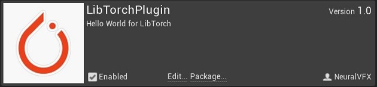
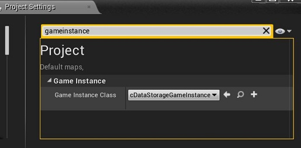
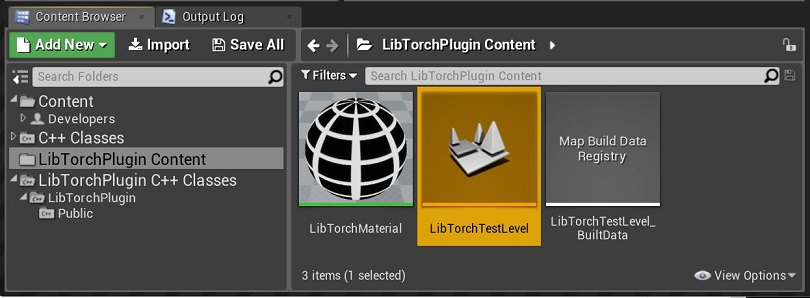
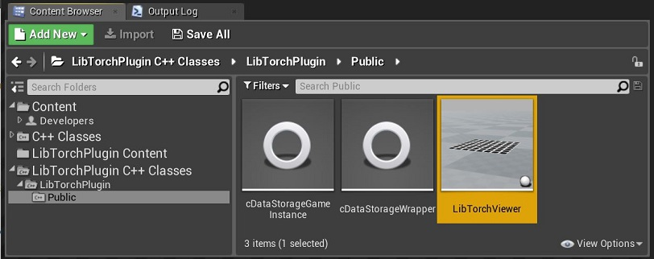

# Getting Started

## Requirements:
- Unreal Engine 4.20.3
- Visual Studio
- OpenCV 4.1.2
- LibTorch 1.5.1 (CPU)

## Project Setup

#### New Project
- Make a C++ Unreal Project 
- Make sure you have a `Plugins` folder inside of the project

#### Compile
- Clone this Repo into the `Plugins` folder: `git clone https://github.com/NeuralVFX/basic-unreal-libtorch-plugin.git` (Or download the zip file and unzip there)
- Right-click your `.uproject` file and click `Generate Visual Studio Project Files`
- Build the project from Visual Studio, using `Build Solution`

#### DLLs
- Follow [directions](https://github.com/NeuralVFX/basic-libtorch-dll ) to compile `export_wrapper.dll` and place into the main plugin directory (ie:`Plugins/basic-unreal-libtorch-plugin`)
- Copy `LibTorch` and `OpenCV` `DLLs` into the plugin's `Binaries` folder (ie:`Plugins/basic-unreal-libtorch-plugin/Binaries/Win64`)

#### Find Plugin
- Open the compiled project in Unreal Engine
- From `Edit->Plugins`, locate the `Other` Category
- Find `LibTorchPlugin` and click `Enable`

#### Set GameInstance

- Open `Settings->Project` and find `GameInstanceClass`, replace this with `cDataStorageGameInstance`

## Run It

#### Run Test Scene

- In the Content Manager, navigate to `LibTorchPlugin Content->LibTorchTestLevel` and open this level
- Play the level, and you should see the Style Transfer on the `LibTorchViewer` object

#### Scene Setup From Scratch

- In the Content Manager, navigate to `LibTorchPlugin C++ Classes->LibTorchPlugin->Public`
- Click on `LibTorchViewer` and drag this into your scene file
- Play the level, and you should see the Style Transfer on the `LibTorchViewer` object

## Classes

#### LibTorchViewer - Actor Class
- Actor Class which displays LibTorch output as a texture
- On every tick, this retrieves and updates texture
- The texture is queried from `UDataStorageGameInstance`

#### cDataStoageWrapper - Object Class
- Wrapper for `export_wrapper.dll`
- Finds and initiates `DLL`
- Exposes functions of `DLL`

#### UDataStorageGameInstance - GameInstance Class
- This is a wrapper for `cDataStoageWrapper`
- Manages starting and stopping `OpenCV` based on the game state
- Retrieves `LibTorch` output, to pass on to `LibTorchViewer `

## Content

#### LibTorchMaterial - Material
- A Material for displaying LibTorch output
- Has a `Parameter` called `LibTorchInput`, used to locate the texture of this material from the `LibTorchViewer` class in C++
- This Material is assigned by default to the `LibTorchViewer` Actor on creation

#### LibTorchTestLevel - Level
- A simple example level containing a `LibTorchViewer`
